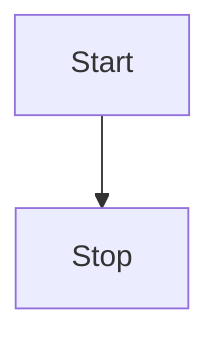
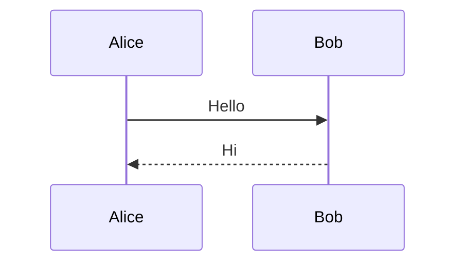
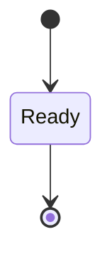
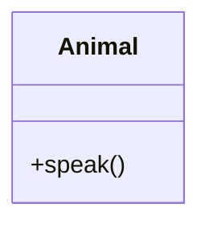

# Math and Diagrams

Inline math $x_1^2 + \sqrt{y}$ and nested fractions \(\frac{1}{1 + \frac{1}{n}}\).

$$
\begin{matrix}
a & b \\
c & d
\end{matrix}
$$

\[
\begin{aligned}
f(x) &= x^2 + 1 \\
g(x) &= \sqrt{x_2}
\end{aligned}
\]

An invalid formula remains readable: $\frac{1}{2$.





```mermaid
this is not a valid mermaid diagram
```

After invalid diagram remains visible.





See [[Reference|the reference note]].
