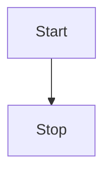
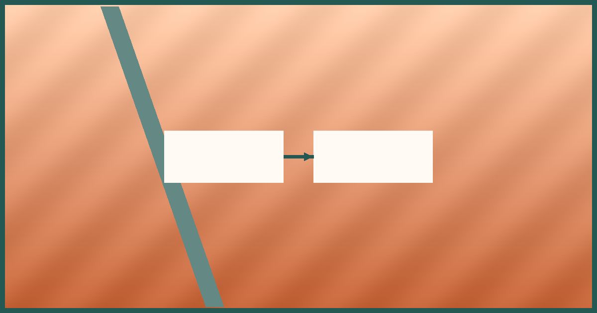

# Launch Pad

Welcome to the fixture graph with [[body-html|Body HTML]], [[shared-note|shared note]], [[shared-note#Shared Section|section jump]], [[private|Private]], [[duplicate|duplicate]], and [[Missing Page]].

Inline tags #field and #parent/child keep the tag pages populated.

> [!note] Build Notes
> Visible copy with ==highlighted text== and %% hidden comment [[Ignore Me]] %% surviving output.

Inline math $a^2+b^2=c^2$ sits above the display block.

$$
E = mc^2
$$



```dataview
LIST FROM #field
```


![[photo.png|480]]
![[shared-note]]
![[shared-note#Shared Section]]
![[cycle-a]]
